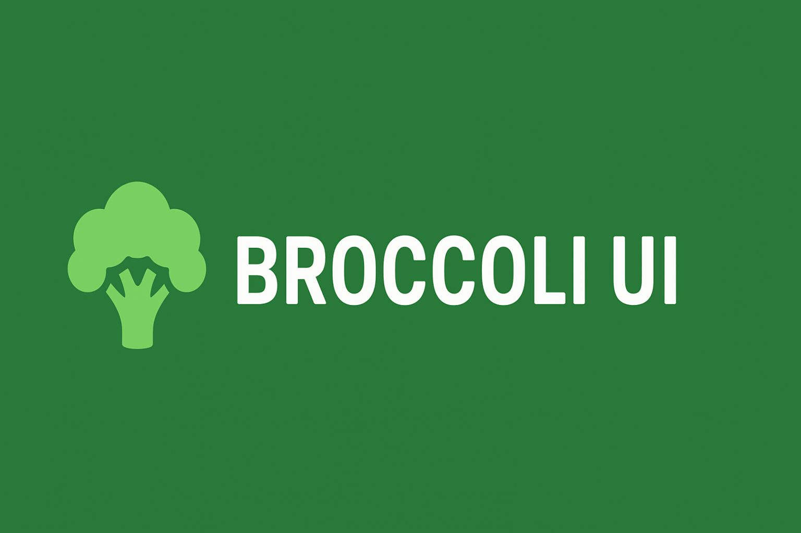

# [WIP] BROCCOLI-UI



## Philosophy

When working at a company, we often want to finish tasks as quickly as possible. That’s why we tend to use libraries. However, the very first thing we do after adopting a library is customizing it to fit the concept of our project. This process often consumes more mental energy and time than expected.

This library introduces the “headless” concept to address that inefficiency. It lets you take only the logic you need and easily adapt the rest to your own style.

## Installation

```bash
$ npm install @hsjprime/broccoli-ui
```
